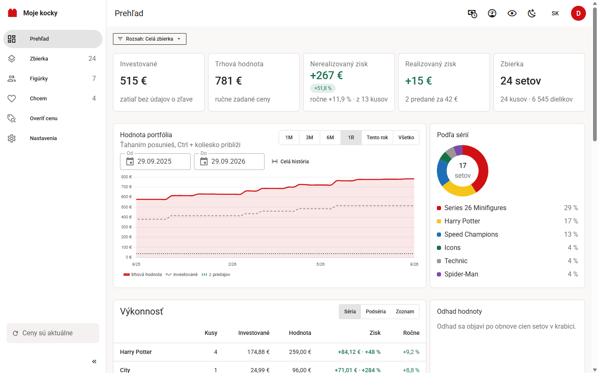
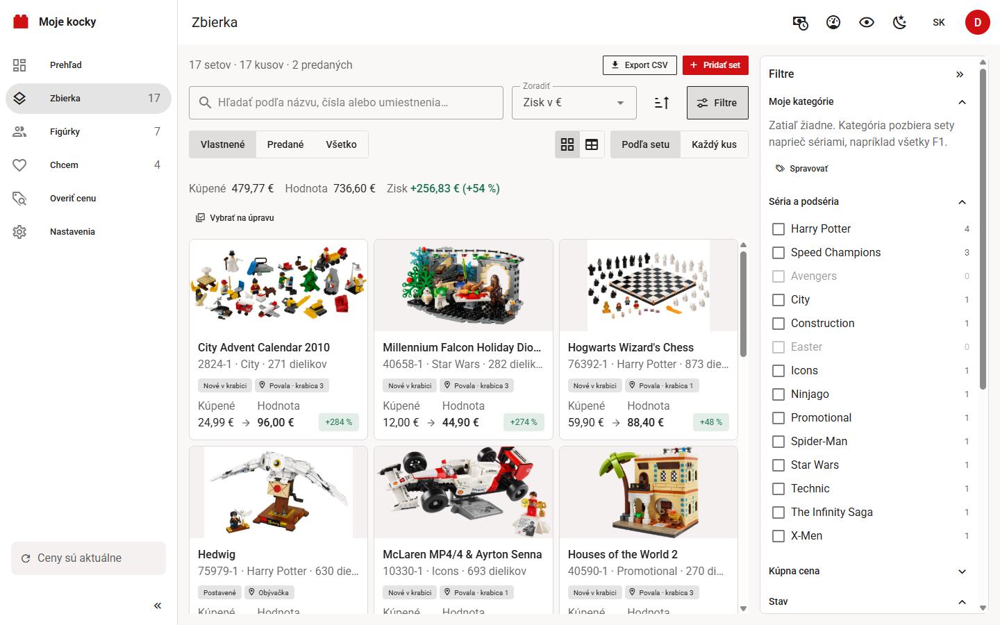
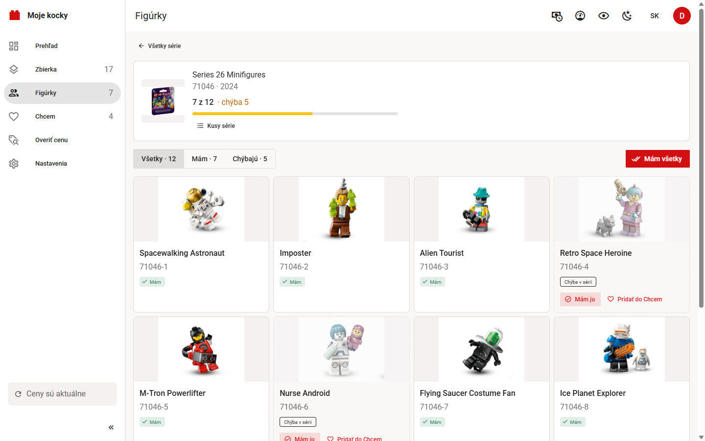

# Moje kocky Desktop

**[English version below](#english)**

### [Stiahnuť inštalátor pre Windows](https://github.com/jakubmatisak/moje-kocky-desktop/releases/latest)

Verzia 1.2.1 · zadarmo, bez reklám a sledovania · Windows 10 a 11 (64-bit) ·
pre všetkých používateľov počítača, inštalátor si vypýta práva správcu ·
[stránka projektu](https://jakubmatisak.github.io/moje-kocky/) ·
[webová verzia na vlastný server](https://github.com/jakubmatisak/moje-kocky-webapp)

V časti **Releases** vpravo je vždy najnovší `MojeKocky-Setup-x.y.z.exe`
(v zozname súborov pod **Assets**). Inštalátor nie je podpísaný, Windows preto raz
ukáže „Windows chránil tento počítač“: **Ďalšie informácie → Spustiť aj tak**.

Evidencia zbierky LEGO® setov ako **bežná inštalácia pre Windows**. Je to tá
istá evidencia ako webové [Moje kocky](https://github.com/jakubmatisak/moje-kocky-webapp)
(okrem odkazu na pozretie, ten má len webová verzia),
len beží v okne na tvojom počítači: bez servera, bez Dockeru a **bez
otvoreného portu**. Všetky údaje (zbierka, fotky, kľúče) ostávajú u teba
v `%APPDATA%\MojeKocky` a pri každej aktualizácii sa databáza najprv sama
zálohuje.



| Zbierka | Figúrky |
| --- | --- |
|  |  |

*Snímky sú z ukážkovej zbierky s vymyslenými, ručne zadanými cenami.*


## Čo to vie

**Evidencia**

- **Po kusoch.** Tri rovnaké sety sú tri záznamy, každý s vlastným stavom
  (v krabici, postavený, rozobratý…), cenou, dátumom a umiestnením.
- **Umiestnenie v dvoch úrovniach**: miestnosť a číslo krabice, s našepkávačom.
- **Mám to už?** Pri zadaní čísla sa ukáže výrazný pás, keď set v zbierke je.
- **Zbierka sú sety, figúrky majú vlastnú sekciu.** Zberateľské minifigúrky
  aj blind-box série iných radov (Mighty Machines, Super Mario a pod.) sú len
  vo **Figúrkach**. Séria sa pridáva výberom z mriežky figúrok, nerozbalený
  sáčok sa po rozbalení priradí ku konkrétnej figúrke. Sekcia pozná všetky
  série, aj nezačaté, a ukáže, čo chýba. Zoznam sérií aj figúrky série
  sú ako karty alebo tabuľka. Nerozbalené sáčky, predané figúrky,
  obnova cien a hromadná úprava figúrok série sú v jej detaile (tlačidlo
  **Kusy série**). Prehľad, export aj súpis pre poistku počítajú
  všetko, sety aj figúrky. Keď hľadanie v Zbierke nájde figúrku, Zbierka
  odkáže do Figúrok.
- **Série a vlny.** Koľko setov z témy a roku máš, podľa zoznamu Brickset.
  Set nájdeš podľa názvu alebo čísla aj bez otvárania série: hľadá medzi
  známymi setmi (tvoje sety, Chcem a stiahnuté série) a nič nesťahuje.
- **Vlastné kategórie** s pravidlami (napr. všetko s „F1“ v názve naprieč
  sériami) aj ručným zaradením. Kategória patrí setu a vyberieš ju pri
  pridaní setu, pri úprave kusu aj v detaile setu.
- **Chcem**: zoznam želaných setov s cieľovou cenou a poznámkou, ako karty
  alebo tabuľka, s filtrom podľa série. Set, ktorý na cieľ klesol, sa
  zvýrazní, a set, ktorý už máš, nesie štítok „V zbierke“. Pri zadaní čísla
  upozorní, že set už je v zbierke alebo v Chcem. Pri kúpe vyberieš
  **Pridať a odstrániť z Chcem** alebo **Pridať a nechať v Chcem**
  (napríklad keď chceš ďalší kus).
- **Vlastné fotky kusu** a **súpis pre poistku** na tlač alebo do PDF.
- **Galéria ďalších oficiálnych fotiek setu** z Brickset (dá sa vypnúť).
- **Diely setu** z Rebrickable podľa farby, náhradné zvlášť, a **kontrola
  úplnosti** každého kusu: zadáš, koľko dielika je, kus potom nesie štítok
  „chýbajú N“ a zoznam chýbajúcich sa uloží do CSV. **Čo ešte z neho
  postavíš**: alternatívne stavby z dielikov setu s odkazom na Rebrickable.
  Oboje sa stiahne raz na set, až keď kartu rozbalíš.

**Pridávanie**

- **Čítačka čiarových kódov** (USB, v režime klávesnice) aj **kamera**
  počítača. Sken funguje z ktorejkoľvek obrazovky. Rovnaký kód zvýši počet,
  iný kód uloží rozpracovaný set a načíta nový; každé uloženie sa dá vrátiť
  tlačidlom Späť.
- **Pamäť formulára**: stav, dátum a umiestnenie z minulého setu sa predvyplnia.
- **Hromadný import** z Excelu alebo CSV so šablónou, náhľadom a vrátením.
  Export do CSV.
- **Bez kľúča Rebrickable** sa set dá uložiť ručne, len číslom.

**Peniaze**

- **Dva druhy zisku oddelene.** Nerealizovaný (trhová hodnota mínus kúpna
  cena toho, čo vlastníš) a realizovaný (čistý z predajov, po poplatkoch
  a poštovnom). Nikdy sa nesčítajú do jedného čísla.
- **Ročný výnos** kusu, série, zoznamu aj celej zbierky, od roka držania.
- **V dnešných peniazoch**: prepočet kúpnych cien infláciou (HICP Slovensko).
- **Mena zobrazenia**: sumy v eurách, korunách, dolároch, librách, zlotých,
  forintoch alebo frankoch, prepočítané dnešným kurzom ECB. Ukladá sa ďalej
  v eurách. Kúpu a predaj sa dá zadať aj v inej mene: na eurá sa prepočíta
  kurzom zo dňa kúpy a pôvodná suma ostane pri kuse.
- **Odhad hodnoty** kusov v krabici o 2 a 5 rokov.
- **Kto sa hýbe**: zmena trhovej ceny za 30, 90 a 365 dní.
- **Bez ceny pomlčka, nie nula.** Kus bez trhovej ceny ukáže „–“ alebo „cena
  neznáma“, nie 0 € a −100 %. Rovnako súčet skupiny, v ktorej cenu nemá
  žiadny kus. Znak ≈ pred sumou znamená, že je to cena druhého stavu, napríklad
  postavený kus setu, ktorý je ešte v predaji, ocenený cenou nového.
- **Overiť cenu**: v obchode naskenuješ krabicu a hneď vidíš, čo to je, či to
  máš, cenu nového aj použitého kusu a graf histórie. Overené sety sa
  pamätajú v tabuľke.
- **Návrh ceny a text inzerátu** pre Aukro alebo Bazoš.
- **Skryť ceny** jedným klikom, keď niekomu ukazuješ portfólio.

**Prehľad a zoznamy**

- Filtre, ktoré sa skladajú (v skupine ALEBO, medzi skupinami A), hľadanie
  bez diakritiky, desať spôsobov zoradenia, uložené pohľady, karty alebo
  tabuľka, hromadná úprava vybraných kusov.
- Tabuľky v Zbierke, Chcem a Overiť cenu majú malú fotku setu, aby sa set
  dal spoznať na prvý pohľad.
- Prehľad sa dá zúžiť na sériu, kategóriu, zoznam alebo uložený pohľad.
- Kým sa stránka načítava, ukáže kostru v tvare obsahu, nie prázdny zoznam;
  keď sa načítať nepodarí, povie to a ponúkne Skúsiť znova. Tlačidlo
  **Obnoviť stránku** v hornej lište načíta údaje znova, filtre aj rozpísaný
  formulár ostanú.

**Ostatné**

- Viac ľudí na jednom počítači (napríklad členovia rodiny), každý so
  svojou zbierkou, heslom a kľúčmi. Každý používateľ Windows má vlastné
  údaje a prvý účet si v nich založí sám, bez povolenia. Pod jedným
  používateľom Windows môže byť aj viac účtov; ďalší povolí prvý účet
  (správca) v Nastaveniach → Aplikácia.
- **Zapamätať si prihlásenie na tomto počítači**: so zaškrtnutým políčkom
  sa po otvorení Mojich kociek netreba prihlasovať, 30 dní od posledného použitia.
  Odhlásenie ho zruší. Zmena hesla zruší prihlásenia účtu všade inde, okno,
  v ktorom heslo meníš, ostane prihlásené aj so zapamätaním.
- Rozhranie po slovensky aj po anglicky, svetlý a tmavý režim. Nastavenia
  zobrazenia sa pamätajú pri účte. Inštalátor a odinštalovanie hovoria
  jazykom, ktorý si vyberieš na začiatku inštalácie (ponúkne jazyk
  Windows), okno pri zlyhanom štarte jazykom Windows.
- Prehľad spotreby volaní cudzích služieb a prepínače, čo sa z ktorej
  služby smie sťahovať.
- **Automatická záloha databázy** pri každej aktualizácii
  ([nižšie](#zaloha)).

## Inštalácia

1. Stiahni `MojeKocky-Setup-x.y.z.exe` (najnovšiu verziu)
   z [Releases](https://github.com/jakubmatisak/moje-kocky-desktop/releases/latest),
   v zozname súborov pod **Assets**.
2. Spusti ho. Inštalátor nie je podpísaný, Windows preto raz ukáže
   „Windows chránil tento počítač“: klikni **Ďalšie informácie → Spustiť
   aj tak**. Ak Windows napíše, že nemôže získať prístup k súboru, antivírus
   inštalátor zablokoval: v **Zabezpečení Windows → História ochrany** daj
   **Povoliť v zariadení** a spusti ho znova.
3. Inštalátor si vypýta práva správcu: Windows sa opýta, či mu povoliť
   zmeny v zariadení (vydavateľ je neznámy, lebo inštalátor nie je
   podpísaný), na bežnom účte aj heslo správcu. Program sa nainštaluje do
   `C:\Program Files\MojeKocky` pre všetkých používateľov počítača, s ikonou
   v ponuke Štart a na ploche pre každého. Údaje má každý používateľ
   vlastné, v `%APPDATA%\MojeKocky`.
4. Pri prvom spustení si vytvoríš účet s heslom. Pri ďalších sa pýta heslo.

Potrebuje Windows 10 alebo 11 (64-bit) a Microsoft Edge WebView2, ktorý
v nich býva. Ak chýba, inštalátor ponúkne stránku na jeho stiahnutie.

**Údaje** sú v `%APPDATA%\MojeKocky`: `lego.db` (databáza), `photos\`,
`secret.key` (šifruje uložené kľúče k službám), `logs\` (denník
`moje-kocky.log`) a `backups\` (zálohy databázy pri aktualizácii). Úplná
záloha je kópia celého priečinka, najlepšie pri zatvorenom okne. Nová
verzia sa nainštaluje cez starú a údaje ostanú. Odinštalovanie sa opýta,
či zmazať údaje účtu Windows, pod ktorým po otázke UAC beží; otázka ho
menuje aj s priečinkom (predvolene nie) a údaje ostatných používateľov
počítača ostanú. Keď na bežnom účte zadáš heslo iného účtu správcu, beží
pod ním: nezmaže nič, ani jemu, ani tebe, a povie, že tvoje údaje ostali
v `%APPDATA%\MojeKocky`. Ten priečinok potom zmažeš sám.

**Aktualizácia zo staršej verzie 0.1.x.** Tá bola len pre jedného
používateľa, v `%LOCALAPPDATA%\Programs\MojeKocky`. Inštalátor 1.0.0 ju
sám odstráni (program, skratky a položku v zozname aplikácií, bez starého
odinštalátora) a údaje v `%APPDATA%\MojeKocky` nechá; pred prvým štartom
novej verzie sa databáza zálohuje. Keď stará verzia ešte beží, inštalátor
povie „Zavri Moje kocky a spusti inštaláciu znova.“ a nič nezmení. Keď
súbor v jej priečinku drží otvorený iný program (antivírus, okno
Prieskumníka), inštalátor povie, že priečinok sa nepodarilo celý zmazať;
po zatvorení toho programu ho spusti znova a dokončí to. Ikonu
pripnutú na paneli úloh treba pripnúť znova. Odstráni sa len stará
inštalácia účtu, pod ktorým inštalátor beží. Keď mal 0.1.x aj ďalší
používateľ počítača, alebo keď na bežnom účte zadáš heslo iného účtu
správcu, stará verzia toho používateľa ostane: odinštaluje si ju sám
v **Nastaveniach → Aplikácie** (položka Moje kocky s verziou 0.1.x)
a otázku, či zmazať aj údaje, zamietne.

<a id="zaloha"></a>

### Záloha pri aktualizácii

Pri prvom spustení inej verzie, novšej aj staršej, a aj vtedy, keď
sa schéma databázy nemení, sa databáza najprv skopíruje do
`%APPDATA%\MojeKocky\backups` a až potom sa prípadne zmigruje. Kópia ide
cez zálohovacie API SQLite, takže je úplná a konzistentná.

- **Meno** je `lego-RRRRMMDD-HHMMSS-v<verzia>-<revízia>.db`, napríklad
  `lego-20261015-083000-v1.0.0-<revízia>.db`: čas zálohy a verzia Mojich kociek
  a revízia schémy, s ktorými databáza do štartu bola, teda verzia, ktorá
  bežala naposledy. Databáza zo staršej inštalácie, ktorá si verziu ešte
  nezapisovala, má v mene len revíziu.
- **Koľko sa drží:** po každom úspešnom štarte, aj keď sa nič nezálohovalo,
  ostane posledných 5 záloh a žiadna staršia než 90 dní; ostatné sa zmažú.
  Iné súbory v priečinku ostanú. Po neúspešnom štarte sa nemaže nič,
  aby opakované spúšťanie nevytlačilo zálohu spred aktualizácie.
- **Fotky** v zálohe nie sú, ostávajú v `photos\` a aktualizácia na ne
  nesiaha.
- **Nezálohuje sa** nová databáza (prvé spustenie) ani ďalší štart tej
  istej verzie.
- **Keď sa záloha nepodarí** (plný disk, práva), databáza ostane bez zmeny,
  Moje kocky sa nespustia a v okne povedia prečo.
- **Keď zlyhá aktualizácia databázy**, ukáže sa okno s cestou k zálohe
  spred aktualizácie a s postupom návratu. Kým sa databáza odvtedy nezmenila,
  ďalšie spustenie novú zálohu nerobí a ukáže tú istú.

Akú verziu máš, ukazuje Nastavenia → Aplikácia (vidí ju správca, teda prvý
účet) a zoznam nainštalovaných aplikácií vo Windows.

**Ako vrátiť zálohu**

1. Zatvor Moje kocky.
2. V `%APPDATA%\MojeKocky` zmaž `lego.db-journal`, `lego.db-wal`
   a `lego.db-shm`, ak tam sú. Inak by ich SQLite pri ďalšom otvorení
   vrátil do obnoveného súboru a pokazil ho.
3. Zálohu z `backups\` skopíruj na miesto `lego.db` (pôvodný súbor si
   môžeš odložiť pod iným menom).
4. Keď aktualizácia zlyhala, nainštaluj z
   [Releases](https://github.com/jakubmatisak/moje-kocky-desktop/releases)
   predchádzajúcu verziu (tú z mena zálohy) a nechaj ju, kým nevyjde oprava.
   Nová by databázu skúsila zmigrovať znova. Pred návratom na 0.1.x najprv
   odinštaluj novú verziu (otázku, či zmazať aj údaje, zamietni): 0.1.x sa
   inštaluje len pre jedného používateľa a nová by inak ostala vedľa nej.

### Ako to funguje bez servera

Okno (pywebview nad WebView2) načíta stránku zo súborov a každé volanie
rozhrania pošle priamo Pythonu v tom istom procese (most `window.pywebview.api`
→ FastAPI cez `httpx.ASGITransport`). Na žiadnom porte nič nepočúva.

## Kľúče k službám

Moje kocky fungujú aj bez kľúčov; vtedy je to evidencia, kde si názov setu a cenu
vyplníš sám. Každá služba pridá niečo navyše.

Kľúče vložíš v **Nastaveniach → Dáta**. Kde nejaký kľúč chýba,
rozhranie to povie priamo pri údaji (a na Prehľade v karte „Čo ešte Moje kocky vedia“)
aj s odkazom na pripojenie. Kľúče sú uložené zašifrované v databáze na tomto
počítači a rozhranie ukáže len ich koncovku. Šifruje ich súbor
`%APPDATA%\MojeKocky\secret.key`: keby sa stratil, zbierka ostane, len
kľúče treba zadať znova.

| Služba | Na čo je | Cena a limit | Kľúč |
|---|---|---|---|
| [Rebrickable](https://rebrickable.com/api/) | názvy, roky, dieliky, fotky, série, figúrky, zoznam dielov, alternatívne stavby | zdarma, ~1 volanie/s | nastavenia účtu na rebrickable.com |
| [Brickset](https://brickset.com/article/52664/api-version-3-documentation) | pôvodná cena, čiarové kódy, popis, štítky, vlny sérií, ďalšie fotky setu | zdarma, 100 volaní/deň | [žiadosť o kľúč](https://brickset.com/tools/webservices/requestkey) |
| [BrickEconomy](https://www.brickeconomy.com/api-reference) | trhová cena nového a použitého kusu, história, odhady | súčasť Premium, 100 volaní/deň | profil na brickeconomy.com |
| [UPCitemdb](https://www.upcitemdb.com/) | záložné hľadanie podľa čiarového kódu | zdarma, bez kľúča, ~100 dotazov/deň na IP adresu | netreba, zapína sa v Nastaveniach |
| [Eurostat](https://ec.europa.eu/eurostat/) | inflácia pre prepočet do dnešných peňazí | zdarma, bez kľúča | netreba, zapína sa v Nastaveniach |
| [ECB](https://www.ecb.europa.eu/stats/policy_and_exchange_rates/euro_reference_exchange_rates/html/index.en.html) | kurzy pre menu zobrazenia a kúpu v cudzej mene | zdarma, bez kľúča, najviac raz denne | netreba, len pri inej mene než euro |

### Ako sa šetria volania

Nič sa nedeje samo od seba, nie je tu plánovač. Obnovu cien spúšťa tlačidlo
v hornej lište a beží na pozadí. Pred spustením sa dialóg spýta, koľko cien
obnoviť (predvolene 50, najviac toľko, koľko dnes ostáva) a ukáže, koľko
volaní je dnes použitých. Denná kvóta BrickEconomy je 100 volaní, preto:

1. Hromadná obnova sa nepýta na položku, na ktorú sa pýtala pred menej než
   týždňom, ani keď vtedy zdroj cenu nemal.
2. Na jedno spustenie najviac toľko položiek, koľko si vyberieš v dialógu
   (a najviac dávka z karty BrickEconomy). Najprv tie, ktorých cenu ešte
   nepoznáme (naposledy pridané prvé), potom od najstaršej; zvyšok pri
   ďalšom.
3. Platí zvyšok dennej kvóty, po odpovedi 429 sa dávka zastaví.
4. Jedno volanie na set: odpoveď nesie cenu nového aj použitého kusu
   a históriu, takže nový aj postavený kus sa obnovia spolu.
5. Overiť cenu nepýta cenu, ktorá je mladšia než 24 hodín.

História cien príde v tej istej odpovedi, graf a „Kto sa hýbe“ teda majú čo
ukazovať hneď po pridaní setu. Brickset a Rebrickable majú v Nastaveniach
vlastné prepínače a rezervu, aby dopĺňanie na pozadí nezjedlo limit
potrebný na pridávanie.

## Vývoj

Potrebuješ Python 3.13 (cez [uv](https://docs.astral.sh/uv/)) a Node 22.

```powershell
cd frontend; npm ci; npm run build-desktop
cd ..\backend; uv sync; uv run moje-kocky
```

`build-desktop` zostaví frontend do `frontend/dist-desktop` (relatívne cesty,
navigácia za `#`, fetch cez most). Testy:

```powershell
cd backend; uv run pytest; uv run ruff check src tests
cd ..\frontend; npm run type-check; npm run lint; npm test
```

### Zostavenie inštalátora

```powershell
powershell -ExecutionPolicy Bypass -File scripts\build.ps1
```

Frontend → PyInstaller (`packaging/moje-kocky.spec`, výsledok
`build/dist/MojeKocky/MojeKocky.exe`) → Inno Setup (`packaging/moje-kocky.iss`,
odstránenie starej inštalácie 0.1.x v `packaging/old-install.iss`,
otázka na údaje pri odinštalovaní v `packaging/uninstall-data.iss`,
výsledok `build/installer/MojeKocky-Setup-<verzia>.exe`). Bez nainštalovaného
Inno Setup skript skončí pri programe. Bez `-Version` zostaví svoju predvolenú
verziu, tú istú ako v `backend/pyproject.toml`. Inú verziu (`-Version X.Y.Z`)
skript nezostaví: podľa nej sa pri aktualizácii zálohuje databáza.

```
backend/src/lego_api/      backend (FastAPI, SQLAlchemy 2, SQLite, Alembic)
backend/src/lego_desktop/  okno, most, %APPDATA%, zámok jednej inštancie
frontend/                  Vue 3, Vuetify 4; src/desktop/ = fetch cez most
packaging/                 PyInstaller, Inno Setup, ikona
scripts/build.ps1          celé zostavenie
docs/release-notes/        text vydania na GitHube
```

### Nové vydanie

1. Zvýš `version` v `backend/pyproject.toml` a spusti `uv lock`.
2. Tú istú verziu daj do `frontend/package.json` aj `package-lock.json`,
   ako predvolenú do `scripts/build.ps1` (`$Version`) a
   `packaging/moje-kocky.iss` (`AppVersion`). Zhodu týchto súborov strážia
   `backend/tests/test_version.py` a `test_desktop_version.py`. README testy
   nekontrolujú: verziu v ňom prepíš ručne v riadku „Verzia“ na začiatku
   a v „Version“ na začiatku anglickej časti.
3. Text vydania napíš do `docs/release-notes/vX.Y.Z.md`, po slovensky a pod
   tým po anglicky. Bez neho dostane Release všeobecný text
   z `docs/release-notes/default.md`.
4. Pošli na GitHub tag `vX.Y.Z` s tou istou verziou. Workflow `release`
   spustí testy, zostaví inštalátor a priloží `MojeKocky-Setup-X.Y.Z.exe`
   k Release. Tag s inou verziou, než je v `pyproject.toml`, `build.ps1`
   odmietne a Release nevznikne.

## Súvisiace repozitáre

- **Desktop pre Windows** (tento repozitár):
  [github.com/jakubmatisak/moje-kocky-desktop](https://github.com/jakubmatisak/moje-kocky-desktop),
  inštalátor v [Releases](https://github.com/jakubmatisak/moje-kocky-desktop/releases/latest).
- **Webová verzia** na vlastný server (Docker):
  [github.com/jakubmatisak/moje-kocky-webapp](https://github.com/jakubmatisak/moje-kocky-webapp).
- **Stránka projektu**: [jakubmatisak.github.io/moje-kocky](https://jakubmatisak.github.io/moje-kocky/),
  zdroj v [github.com/jakubmatisak/moje-kocky](https://github.com/jakubmatisak/moje-kocky).

Desktop je samostatná kópia kódu webovej verzie; zmeny sa medzi nimi
prenášajú ručne.

## Zdroje dát a poďakovanie

Moje kocky je nezávislý projekt fanúšika. Nie je spojený so skupinou LEGO
Group ani s nižšie uvedenými službami a nie je nimi sponzorovaný ani schválený.

LEGO® je ochranná známka skupiny spoločností LEGO Group, ktorá tento projekt
nesponzoruje, neautorizuje ani neschvaľuje. *(LEGO® is a trademark of the LEGO
Group of companies which does not sponsor, authorize or endorse this site.)*
Obrázky setov a minifigúrok sú chránené autorským právom LEGO Group
a zobrazujú sa len na nekomerčné informačné účely v súlade s pravidlami
[LEGO Fair Play](https://www.lego.com/en-us/legal/notices-and-policies/fair-play).

- **Katalóg setov, minifigúrok a obrázky:** [Rebrickable](https://rebrickable.com),
  cez [Rebrickable API](https://rebrickable.com/api/).
- **Pôvodné ceny, čiarové kódy, popisy, série, vlny a ďalšie fotky setov:**
  [Brickset](https://brickset.com), cez Brickset API v3. Image(s) courtesy of Brickset.com.
- **Trhové ceny a odhady hodnoty:** [BrickEconomy](https://www.brickeconomy.com),
  len pre používateľov s vlastným kľúčom BrickEconomy Premium. Ceny sú odhady
  BrickEconomy, nie investičné poradenstvo.
- **Vyhľadanie podľa čiarového kódu (záložné):** [UPCitemdb](https://www.upcitemdb.com).
- **Inflácia (HICP Slovensko):** Zdroj: Eurostat, dátový súbor
  [prc_hicp_minr](https://ec.europa.eu/eurostat/databrowser/view/prc_hicp_minr/default/table).
  Moje kocky z indexu počítajú prepočet cien do dnešných peňazí; je to úprava dát,
  za ktorú Eurostat nezodpovedá
  ([podmienky opätovného použitia](https://ec.europa.eu/eurostat/help/copyright-notice)).
- **Kurzy mien:** Zdroj: ECB, referenčné výmenné kurzy eura
  ([eurofxref](https://www.ecb.europa.eu/stats/policy_and_exchange_rates/euro_reference_exchange_rates/html/index.en.html)).
  Moje kocky nimi len prepočítavajú sumy, kurzy nemenia.

Kľúče k službám patria jednotlivým používateľom a ich použitie sa riadi
podmienkami danej služby.

### Softvér tretích strán

Backend: [FastAPI](https://fastapi.tiangolo.com), [SQLAlchemy](https://www.sqlalchemy.org),
[Alembic](https://alembic.sqlalchemy.org), [Pydantic](https://docs.pydantic.dev),
[Uvicorn](https://www.uvicorn.org), [HTTPX](https://www.python-httpx.org),
[argon2-cffi](https://argon2-cffi.readthedocs.io), [PyJWT](https://pyjwt.readthedocs.io),
[cryptography](https://cryptography.io), [openpyxl](https://openpyxl.readthedocs.io)
a ďalšie (MIT, BSD, Apache-2.0).

Frontend: [Vue](https://vuejs.org), [Vuetify](https://vuetifyjs.com),
[Pinia](https://pinia.vuejs.org), [Vue Router](https://router.vuejs.org),
[vue-i18n](https://vue-i18n.intlify.dev), [VueUse](https://vueuse.org),
[Chart.js](https://www.chartjs.org) s [vue-chartjs](https://vue-chartjs.org)
a chartjs-plugin-zoom, [openapi-fetch](https://openapi-ts.dev) (MIT);
čítanie kódov [ZXing-C++](https://github.com/zxing-cpp/zxing-cpp) cez
[zxing-wasm](https://github.com/Sec-ant/zxing-wasm) a [barcode-detector](https://github.com/Sec-ant/barcode-detector)
(Apache-2.0, MIT, BSD-3-Clause);
ikony [Material Design Icons](https://pictogrammers.com/library/mdi/) (Apache-2.0);
písmo [Roboto](https://github.com/googlefonts/roboto-classic) (SIL Open Font License 1.1).

Desktop: [Python](https://www.python.org) (PSF-2.0), [pywebview](https://pywebview.flowrl.com)
(BSD-3-Clause), [pythonnet](https://pythonnet.github.io) (MIT),
[Pillow](https://python-pillow.org) (MIT-CMU), zabalené cez
[PyInstaller](https://pyinstaller.org) a [Inno Setup](https://jrsoftware.org/isinfo.php).

Takmer všetko je pod voľnými licenciami (MIT, BSD, ISC, Apache-2.0, PSF). Dve
výnimky: **PyInstaller** je pod GPL-2.0, ale s výnimkou, ktorá výslovne
dovoľuje šíriť ním zabalený program pod vlastnou licenciou. **certifi**
(zoznam certifikačných autorít) je pod MPL-2.0 a je v programe nezmenený;
jeho zdroj je na [github.com/certifi/python-certifi](https://github.com/certifi/python-certifi).
Žiadna závislosť nie je pod AGPL ani LGPL.

Inštalátor pribalí `LICENSE.txt` a `THIRD-PARTY-NOTICES.txt` s textami licencií
všetkých pribalených knižníc (v ponuke Štart: „Licencie softvéru tretích strán“).
Zoznam vytvára `packaging/notices.py` pri každom zostavení z nainštalovaných
balíkov a `package-lock.json`, takže nový balík sa doň dostane sám.

## Licencia

Zdrojový kód je pod licenciou [MIT](LICENSE). Licencia sa nevzťahuje na dáta,
ceny a obrázky zo služieb tretích strán ani na ochrannú známku LEGO® a obrázky
výrobkov LEGO; tie patria svojim vlastníkom.

## Súkromie a licencie

Nie je to právna rada, len to, ako desktopová verzia rieši súkromie
a podmienky služieb (k septembru 2026). Zásady sú aj priamo v programe.

- **Údaje sú len na tvojom počítači** v `%APPDATA%\MojeKocky`. Moje kocky nemajú
  server ani prevádzkovateľa, autor k nim nemá prístup. Ide o osobné použitie
  v domácnosti, na ktoré sa GDPR nevzťahuje (čl. 2 ods. 2 písm. c).
- **Čo odchádza z počítača:** len otázky na služby, ktoré si pripojíš
  (čísla setov a čiarové kódy pod tvojím kľúčom), stiahnutie indexu inflácie
  z Eurostatu (keď ho zapneš) a obrázky setov, ktoré sa načítavajú priamo
  z Rebrickable a Brickset (tie vidia IP adresu počítača).
- **Kým účet nezadá vlastný kľúč, zo služby nevidí nič.** Pri viacerých
  účtoch na jednom počítači vidí každý len to, čo stiahol jeho vlastný kľúč.
- **Tvoje práva a kontrola:** v Nastaveniach → Účet si stiahneš všetky svoje
  údaje (ZIP) alebo zmažeš účet. Odinštalovanie sa opýta, či zmazať aj
  priečinok s údajmi účtu Windows, pod ktorým beží; údaje ostatných
  používateľov počítača ostanú. S heslom iného účtu správcu nezmaže nič
  a svoj priečinok `%APPDATA%\MojeKocky` zmažeš sám.
- **Zálohy pri aktualizácii** (posledných 5, najviac 90 dní) sú v
  `%APPDATA%\MojeKocky\backups` a nesú celú databázu; údaje zmazaného účtu
  v nich ostanú, kým sa neprestriedajú, najdlhšie do prvého štartu Mojich
  kociek po 90 dňoch.
- **Fotky** sa ukladajú zmenšené a bez polohy GPS.
- **Sledovanie** Moje kocky nepoužívajú. Okno si pamätá nastavenia zobrazenia
  (tmavý režim, skryté ceny a pod.) a program zapamätané prihlásenie, ak si
  ho zaškrtol: zašifrované v `%APPDATA%\MojeKocky\session.bin` na 30 dní
  od posledného použitia, odhlásenie ho zmaže.
- **Služby:** Rebrickable dovoľuje akékoľvek použitie; BrickEconomy a
  Brickset dávajú osobné licencie ku kľúču, preto ich údaje vidí len účet
  s vlastným kľúčom. Ak svoj kľúč BrickEconomy vložíš do viacerých účtov,
  zdieľaš licenciu.
- **Nekomerčne:** pravidlá LEGO Fair Play aj licencia BrickEconomy platia
  len pre osobné, nekomerčné použitie. Logo LEGO Moje kocky nepoužívajú.

---

<a id="english"></a>

# Moje kocky Desktop (English)

[Slovenská verzia vyššie](#moje-kocky-desktop)

### [Download the Windows installer](https://github.com/jakubmatisak/moje-kocky-desktop/releases/latest)

Version 1.2.1 · free, no ads, no tracking · Windows 10 and 11 (64-bit) ·
for every user of the PC, the installer asks for administrator rights ·
[project website](https://jakubmatisak.github.io/moje-kocky/) ·
[web version for your own server](https://github.com/jakubmatisak/moje-kocky-webapp)

The **Releases** section on the right always has the latest
`MojeKocky-Setup-x.y.z.exe` (in the file list under **Assets**). The installer
is not code-signed, so Windows will warn you once with "Windows protected your
PC": click **More info → Run anyway**.

*Moje kocky* ("my bricks" in Slovak) keeps track of a LEGO® set collection
and comes as a **regular Windows install**. It is the same app as the web
version of [Moje kocky](https://github.com/jakubmatisak/moje-kocky-webapp)
(except view-only links, which only the web version has),
it just runs in a window on your own computer: no server, no Docker and **no
open port**. All your data (collection, photos, keys) stays with you in
`%APPDATA%\MojeKocky`, and the database backs itself up before every update.


| Collection | Minifigures |
| --- | --- |
|  |  |

*The screenshots show a sample collection with made-up, hand-entered prices.
The app's interface is available in Slovak and English.*


## Features

**Keeping records**

- **One record per physical copy.** Three copies of the same set are three
  records, each with its own condition (sealed, built, taken apart…), price,
  date and location.
- **Two-level storage location**: room and box number, with suggestions.
- **Do I already have it?** Typing a set number shows a prominent banner when
  the set is already in your collection.
- **The Collection holds sets; minifigures have a section of their own.**
  Collectible minifigures and blind-box series from other lines (Mighty
  Machines, Super Mario and the like) live only under **Minifigures**. You add
  a series by picking figures from a grid, and a sealed bag can be assigned to
  a specific figure once you open it. The section knows every series, including
  ones you haven't started, and shows what is missing. Both the list of
  series and a series' figures come as cards or a table. Sealed bags, sold
  figures, the price refresh and bulk editing of a series' figures are on
  that series' page (the **Series pieces** button). The Overview, the export
  and the insurance inventory count everything, sets and figures alike. When
  a search in the Collection matches a figure, the app points you to
  Minifigures.
- **Series and waves.** How many sets of a theme and year you own, based on
  Brickset's lists. You can find a set by name or number without opening a
  theme: the search looks among known sets (your sets, the wishlist and
  downloaded themes) and downloads nothing.
- **Custom categories** with rules (e.g. everything with "F1" in the name,
  across themes) as well as manual assignment. A category belongs to the set;
  you pick it when adding a set, when editing a copy and on the set's page.
- **Wishlist**: sets you want, with a target price and a note, as cards or a
  table, with a theme filter. A set that has dropped to its target is
  highlighted, and a set you already own carries an "In collection" tag.
  Typing a number warns you when the set is already in your collection or
  on the wishlist. When you buy one you choose **Add and remove from
  wishlist** or **Add and keep on wishlist** (when you want another copy,
  say).
- **Your own photos of each copy** and an **insurance inventory** to print or
  save as PDF.
- **A gallery of additional official set photos** from Brickset (can be
  turned off).
- **Set parts** from Rebrickable by colour, spares listed apart, and a
  **completeness check** for each copy: enter how many of a part you have,
  the copy then carries a “N parts missing” label and the missing parts
  list can be saved as CSV. **What else you can build**: alternate builds
  from the set's parts with a link to Rebrickable. Both are fetched once per
  set, only when you expand the card.

**Adding sets**

- **Barcode scanner** (USB, in keyboard mode) or your computer's **camera**.
  Scanning works from any screen. The same code again bumps the quantity, a
  different code saves the set in progress and loads the new one; every save
  can be reverted with Undo.
- **Form memory**: condition, date and location are pre-filled from the
  previous set.
- **Bulk import** from Excel or CSV, with a template, a preview and undo.
  Export to CSV.
- **Without a Rebrickable key** you can still save a set by hand, by its
  number alone.

**Money**

- **Two kinds of profit, kept apart.** Unrealised (market value minus the
  purchase price of what you own) and realised (net from sales, after fees
  and shipping). They are never added up into a single number.
- **Annualised return** for a single copy, a theme, a list or the whole
  collection, once it has been held for a year.
- **In today's money**: purchase prices adjusted for inflation (Slovak HICP).
- **Display currency**: amounts in euros, koruna, dollars, pounds, złoty,
  forint or francs, converted at today's ECB rate. Everything is still stored
  in euros. Purchases and sales can be entered in another currency too: they
  are converted at the rate of the purchase day and the original amount stays
  with the copy.
- **Value forecast** for sealed copies, 2 and 5 years out.
- **Biggest movers**: market price change over 30, 90 and 365 days.
- **No price means a dash, not zero.** A copy without a market price shows
  "–" or "price unknown" instead of 0 € and −100 %, and so does the total of
  a group in which no copy has a price. A ≈ in front of an amount means it is
  the price for the other condition, for example a built copy of a set that
  is still on sale, valued at the new price.
- **Check price**: scan a box in the shop and you see right away what it is,
  whether you have it, the price new and used, and a price history chart.
  Checked sets are remembered in a table.
- **Suggested price and listing text** for Aukro or Bazoš (Slovak and Czech
  marketplaces).
- **Hide prices** with one click when showing your portfolio to someone.

**Overview and lists**

- Filters that combine (OR within a group, AND between groups), search that
  ignores diacritics, ten sort orders, saved views, cards or a table, bulk
  editing of selected copies.
- The tables in the Collection, the wishlist and Check price show a small
  picture of the set, so you recognise it at a glance.
- The Overview can be narrowed to a theme, a category, a list or a saved view.
- While a page loads it shows a skeleton shaped like its content, not an
  empty list; when loading fails it says so and offers Try again. The
  **Reload page** button in the top bar loads the data again and keeps the
  filters and any half-filled form.

**Other**

- Several people on one computer (family members, say), each with their own
  collection, password and keys. Every Windows user of the PC has their own
  data and creates their own first account in it, no approval needed. One
  Windows user can also hold several app accounts; the first account (the
  app's administrator) allows more in Settings → Application.
- **Remember me on this computer**: with the box ticked you don't have to
  sign in when you open the app, for 30 days since you last used it. Signing
  out forgets the sign-in. Changing the password ends the account's sign-ins
  everywhere else; the window where you change it stays signed in and
  remembered.
- Slovak and English interface, light and dark mode. Display settings are
  stored with the account. The installer and the uninstaller speak the
  language you pick when the installation starts (the Windows language is
  offered), the window shown when the app fails to start the Windows
  language.
- A usage overview of calls to third-party services, plus switches for what
  may be downloaded from which service.
- **Automatic database backup** on every update ([below](#backup-on-update)).

## Installation

1. Download `MojeKocky-Setup-x.y.z.exe` (the latest version)
   from [Releases](https://github.com/jakubmatisak/moje-kocky-desktop/releases/latest),
   in the file list under **Assets**.
2. Run it. The installer is not code-signed, so Windows will warn you once
   with "Windows protected your PC": click **More info → Run anyway**. If
   Windows says it cannot access the file, your antivirus blocked the
   installer: in **Windows Security → Protection history** choose **Allow on
   device** and run it again.
3. The installer asks for administrator rights: Windows asks whether to let
   it make changes to your device (the publisher shows as unknown because the
   installer is not signed), and on a standard account it also asks for an
   administrator's password. The program is installed into
   `C:\Program Files\MojeKocky` for every user of the PC, with a Start menu
   and desktop icon for everyone. Each user has their own data in
   `%APPDATA%\MojeKocky`.
4. On first launch you create an account with a password. After that it asks
   for the password.

It needs Windows 10 or 11 (64-bit) and Microsoft Edge WebView2, which usually
comes with them. If it is missing, the installer offers a page to download it.

**Your data** lives in `%APPDATA%\MojeKocky`: `lego.db` (the database),
`photos\`, `secret.key` (encrypts the stored service keys), `logs\` (the log
file `moje-kocky.log`) and `backups\` (database backups made on update). A
full backup is simply a copy of the whole folder, ideally with the app
closed. A new version installs over the old one and your data stays.
Uninstalling asks whether to delete the data of the Windows account it runs
as after the UAC prompt; the question names that account and its folder (the
default is no), and other users' data stays. If you enter a different
administrator's password on a standard account, it runs as that
administrator: it deletes nobody's data and tells you that yours stayed in
`%APPDATA%\MojeKocky`. You then delete that folder yourself.

**Updating from an older 0.1.x version.** Those were installed for one user
only, in `%LOCALAPPDATA%\Programs\MojeKocky`. The 1.0.0 installer removes
that install itself (program, shortcuts and the entry in the list of apps,
without running the old uninstaller) and leaves your data in
`%APPDATA%\MojeKocky` alone; the database is backed up before the new
version first starts. If the old version is still running, the installer
says so (close Moje kocky and run the installer again) and changes
nothing. If another program (antivirus, an Explorer window) holds a
file in that folder open, the installer says it could not delete the folder
completely; close that program and run the installer again to finish. A
taskbar pin needs to be pinned again. Only the old
install of the account the installer runs as is removed. If another user of
the PC also had 0.1.x, or if you enter the password of a different
administrator account on a standard account, that user's old version stays:
they uninstall it in **Settings → Apps** (the Moje kocky entry with version
0.1.x) and decline deleting the data.

<a id="backup-on-update"></a>

### Backup on update

The first time a different version of the app starts, newer or older, and
even when the database schema does not change, the app first copies the
database into `%APPDATA%\MojeKocky\backups` and only then migrates it if
needed. The copy is made with SQLite's backup API, so it is complete and
consistent.

- **The name** is `lego-YYYYMMDD-HHMMSS-v<version>-<revision>.db`, for
  example `lego-20261015-083000-v1.0.0-<revision>.db`: the time of the backup
  plus the app version and schema revision the database had before this
  start, i.e. the version that ran last. A database from an older install
  that did not record its version yet has only the revision in the name.
- **How many are kept:** after every successful start, even one that backed
  nothing up, the last 5 backups remain and none older than 90 days; the rest
  are deleted. Other files in the folder are left alone. After a failed start
  nothing is deleted, so repeated launches cannot push out the backup taken
  before the update.
- **Photos** are not part of the backup; they stay in `photos\` and an update
  does not touch them.
- **No backup is made** for a brand-new database (first launch) or for
  another start of the same version.
- **If the backup fails** (disk full, permissions), the app leaves the
  database untouched, does not start and tells you why in a window.
- **If the database update fails**, the app shows a window (Slovak on
  Slovak Windows, English otherwise) with the path to the pre-update
  backup and how to go back. As long as the database has not changed since,
  the next launch does not make a new backup and points to the same one.

You can see which version you have in Settings → Application (visible to the
administrator, i.e. the first account) and in the Windows list of installed
apps.

**How to restore a backup**

1. Close Moje kocky.
2. In `%APPDATA%\MojeKocky`, delete `lego.db-journal`, `lego.db-wal` and
   `lego.db-shm` if they are there. Otherwise SQLite would replay them into
   the restored file the next time it opens it and corrupt it.
3. Copy the backup from `backups\` over `lego.db` (you can keep the original
   file under another name).
4. If the update failed, install the previous version (the one in the backup's
   name) from [Releases](https://github.com/jakubmatisak/moje-kocky-desktop/releases)
   and stay on it until a fix is out. The new version would try to migrate the
   database again. Before going back to 0.1.x, uninstall the new version first
   (decline deleting the data): 0.1.x installs for one user only and the new
   version would otherwise stay next to it.

### How it works without a server

The window (pywebview on top of WebView2) loads the page from files and sends
every app request straight to Python in the same process (a bridge from
`window.pywebview.api` to FastAPI via `httpx.ASGITransport`). Nothing listens
on any port.

## Service keys

The app works without any keys too; it is then a catalogue where you fill in
set names and prices yourself. Each service adds something on top.

You enter keys in the app under **Settings → Data**. Wherever a key is
missing, the app says so right next to the data (and on the Overview in the
"What else the app can do" card), with a link to connect it. Keys are stored
encrypted in the database on this computer and the interface only shows their
last characters. They are encrypted with the file
`%APPDATA%\MojeKocky\secret.key`: if it is lost, the collection stays, you
just have to enter the keys again.

| Service | What it provides | Price and limit | Key |
|---|---|---|---|
| [Rebrickable](https://rebrickable.com/api/) | names, years, part counts, photos, themes, minifigures, parts lists, alternate builds | free, ~1 call/s | account settings on rebrickable.com |
| [Brickset](https://brickset.com/article/52664/api-version-3-documentation) | retail price, barcodes, description, tags, theme waves, additional set photos | free, 100 calls/day | [request a key](https://brickset.com/tools/webservices/requestkey) |
| [BrickEconomy](https://www.brickeconomy.com/api-reference) | market price new and used, history, forecasts | part of Premium, 100 calls/day | profile on brickeconomy.com |
| [UPCitemdb](https://www.upcitemdb.com/) | fallback barcode lookup | free, no key, ~100 lookups/day per IP address | none, switched on in Settings |
| [Eurostat](https://ec.europa.eu/eurostat/) | inflation for converting to today's money | free, no key | none, switched on in Settings |
| [ECB](https://www.ecb.europa.eu/stats/policy_and_exchange_rates/euro_reference_exchange_rates/html/index.en.html) | rates for the display currency and purchases in another currency | free, no key, at most once a day | none, only for a currency other than the euro |

### How calls are rationed

Nothing happens on its own; there is no scheduler. A price refresh is started
with the button in the top bar and runs in the background. Before it starts,
a dialog asks how many prices to refresh (50 by default, at most what is left
today) and shows how many calls were used today. BrickEconomy's daily quota
is 100 calls, so:

1. A bulk refresh skips items it asked about less than a week ago, even when
   the source had no price then.
2. At most as many items per run as you pick in the dialog (and no more than
   the batch size on the BrickEconomy card). Items with no known price go
   first (most recently added first), then the oldest; the rest next time.
3. The remaining daily quota is respected, and the batch stops after a 429
   response.
4. One call per set: the response carries the price new and used plus the
   history, so sealed and built copies are refreshed together.
5. Check price does not fetch a price younger than 24 hours.

The price history comes in the same response, so the chart and Biggest movers
have something to show right after you add a set. Brickset and Rebrickable have
their own switches and a reserve in Settings, so that background filling does
not eat the limit you need for adding sets.

## Development

You need Python 3.13 (via [uv](https://docs.astral.sh/uv/)) and Node 22.

```powershell
cd frontend; npm ci; npm run build-desktop
cd ..\backend; uv sync; uv run moje-kocky
```

`build-desktop` builds the frontend into `frontend/dist-desktop` (relative
paths, navigation after `#`, fetch over the bridge). Tests:

```powershell
cd backend; uv run pytest; uv run ruff check src tests
cd ..\frontend; npm run type-check; npm run lint; npm test
```

### Building the installer

```powershell
powershell -ExecutionPolicy Bypass -File scripts\build.ps1
```

Frontend → PyInstaller (`packaging/moje-kocky.spec`, output
`build/dist/MojeKocky/MojeKocky.exe`) → Inno Setup (`packaging/moje-kocky.iss`,
removal of an old 0.1.x install in `packaging/old-install.iss`,
the question about data on uninstall in `packaging/uninstall-data.iss`,
output `build/installer/MojeKocky-Setup-<version>.exe`). Without Inno Setup
installed the script stops after the program. Without `-Version` it builds
its default version, the same as in `backend/pyproject.toml`. Any other
version (`-Version X.Y.Z`) is refused: the app relies on it to back up the
database on update.

```
backend/src/lego_api/      the app (FastAPI, SQLAlchemy 2, SQLite, Alembic)
backend/src/lego_desktop/  window, bridge, %APPDATA%, single-instance lock
frontend/                  Vue 3, Vuetify 4; src/desktop/ = fetch over the bridge
packaging/                 PyInstaller, Inno Setup, icon
scripts/build.ps1          the whole build
docs/release-notes/        release notes on GitHub
```

### New release

1. Bump `version` in `backend/pyproject.toml` and run `uv lock`.
2. Put the same version into `frontend/package.json` and `package-lock.json`,
   as the default in `scripts/build.ps1` (`$Version`) and
   `packaging/moje-kocky.iss` (`AppVersion`).
   `backend/tests/test_version.py` and `test_desktop_version.py` check that
   these files match. The tests do not check this README: update the version
   by hand in the "Verzia" line at the top and the "Version" line at the top
   of the English part.
3. Write the release notes into `docs/release-notes/vX.Y.Z.md`, in Slovak
   with English below. Without that file the Release gets the general text
   from `docs/release-notes/default.md`.
4. Push the tag `vX.Y.Z` with the same version. The `release` workflow runs
   the tests, builds the installer and attaches `MojeKocky-Setup-X.Y.Z.exe`
   to the Release. A tag with a version other than the one in
   `pyproject.toml` is refused by `build.ps1` and no Release is created.

## Related repositories

- **Windows desktop** (this repository):
  [github.com/jakubmatisak/moje-kocky-desktop](https://github.com/jakubmatisak/moje-kocky-desktop),
  installer under [Releases](https://github.com/jakubmatisak/moje-kocky-desktop/releases/latest).
- **Web version** for your own server (Docker):
  [github.com/jakubmatisak/moje-kocky-webapp](https://github.com/jakubmatisak/moje-kocky-webapp).
- **Project website**: [jakubmatisak.github.io/moje-kocky](https://jakubmatisak.github.io/moje-kocky/),
  source in [github.com/jakubmatisak/moje-kocky](https://github.com/jakubmatisak/moje-kocky).

The desktop app is a separate copy of the web version's code; changes are
carried over between them by hand.

## Data sources and credits

Moje kocky is an independent fan project. It is not affiliated with the LEGO
Group or with any of the services listed below, and is not sponsored or
endorsed by them.

LEGO® is a trademark of the LEGO Group of companies which does not sponsor,
authorize or endorse this site. Images of sets and minifigures are copyright
of the LEGO Group and are shown for non-commercial, informational purposes
only, in line with the
[LEGO Fair Play](https://www.lego.com/en-us/legal/notices-and-policies/fair-play)
guidelines.

- **Set and minifigure catalogue and images:** [Rebrickable](https://rebrickable.com),
  via the [Rebrickable API](https://rebrickable.com/api/).
- **Retail prices, barcodes, descriptions, themes, waves and additional set
  photos:** [Brickset](https://brickset.com), via the Brickset API v3.
  Image(s) courtesy of Brickset.com.
- **Market prices and value forecasts:** [BrickEconomy](https://www.brickeconomy.com),
  only for users with their own BrickEconomy Premium key. Prices are
  BrickEconomy's estimates, not investment advice.
- **Barcode lookup (fallback):** [UPCitemdb](https://www.upcitemdb.com).
- **Inflation (Slovak HICP):** Source: Eurostat, dataset
  [prc_hicp_minr](https://ec.europa.eu/eurostat/databrowser/view/prc_hicp_minr/default/table).
  The app uses the index to convert prices into today's money; this is an
  adaptation of the data for which Eurostat bears no responsibility
  ([reuse policy](https://ec.europa.eu/eurostat/help/copyright-notice)).
- **Exchange rates:** Source: ECB, euro foreign exchange reference rates
  ([eurofxref](https://www.ecb.europa.eu/stats/policy_and_exchange_rates/euro_reference_exchange_rates/html/index.en.html)).
  The app only converts amounts with them and does not alter the rates.

Service keys belong to the individual users, and their use is governed by
each service's terms.

### Third-party software

Backend: [FastAPI](https://fastapi.tiangolo.com), [SQLAlchemy](https://www.sqlalchemy.org),
[Alembic](https://alembic.sqlalchemy.org), [Pydantic](https://docs.pydantic.dev),
[Uvicorn](https://www.uvicorn.org), [HTTPX](https://www.python-httpx.org),
[argon2-cffi](https://argon2-cffi.readthedocs.io), [PyJWT](https://pyjwt.readthedocs.io),
[cryptography](https://cryptography.io), [openpyxl](https://openpyxl.readthedocs.io)
and others (MIT, BSD, Apache-2.0).

Frontend: [Vue](https://vuejs.org), [Vuetify](https://vuetifyjs.com),
[Pinia](https://pinia.vuejs.org), [Vue Router](https://router.vuejs.org),
[vue-i18n](https://vue-i18n.intlify.dev), [VueUse](https://vueuse.org),
[Chart.js](https://www.chartjs.org) with [vue-chartjs](https://vue-chartjs.org)
and chartjs-plugin-zoom, [openapi-fetch](https://openapi-ts.dev) (MIT);
barcode reading by [ZXing-C++](https://github.com/zxing-cpp/zxing-cpp) via
[zxing-wasm](https://github.com/Sec-ant/zxing-wasm) and [barcode-detector](https://github.com/Sec-ant/barcode-detector)
(Apache-2.0, MIT, BSD-3-Clause);
[Material Design Icons](https://pictogrammers.com/library/mdi/) (Apache-2.0);
the [Roboto](https://github.com/googlefonts/roboto-classic) font (SIL Open Font License 1.1).

Desktop: [Python](https://www.python.org) (PSF-2.0), [pywebview](https://pywebview.flowrl.com)
(BSD-3-Clause), [pythonnet](https://pythonnet.github.io) (MIT),
[Pillow](https://python-pillow.org) (MIT-CMU), packaged with
[PyInstaller](https://pyinstaller.org) and [Inno Setup](https://jrsoftware.org/isinfo.php).

Almost everything is under permissive licences (MIT, BSD, ISC, Apache-2.0,
PSF). Two exceptions: **PyInstaller** is GPL-2.0, but with an exception that
explicitly allows distributing a program bundled with it under its own
licence. **certifi** (the list of certificate authorities) is MPL-2.0 and is
included unmodified; its source is at
[github.com/certifi/python-certifi](https://github.com/certifi/python-certifi).
No dependency is under AGPL or LGPL.

The installer ships `LICENSE.txt` and `THIRD-PARTY-NOTICES.txt` with the
licence texts of all bundled libraries (in the Start menu as "Licencie softvéru
tretích strán", i.e. third-party software licences). The list is generated by
`packaging/notices.py` on every build from the installed packages and
`package-lock.json`, so a new package ends up in it automatically.

## Licence

The source code is licensed under [MIT](LICENSE). The licence does not cover
data, prices and images from third-party services, nor the LEGO® trademark
and images of LEGO products; those belong to their respective owners.

## Privacy and licences

This is not legal advice, just a description of how the desktop app handles
privacy and the services' terms (as of September 2026). The policy is also
available inside the app.

- **Your data is only on your computer**, in `%APPDATA%\MojeKocky`. The app
  has no server and no operator, and its author has no access to your data.
  This is personal use within a household, to which the GDPR does not apply
  (Art. 2(2)(c)).
- **What leaves your computer:** only requests to the services you connect
  (set numbers and barcodes, under your own key), the inflation index
  download from Eurostat (if you turn it on), and set images, which are loaded
  directly from Rebrickable and Brickset (they see your computer's IP
  address).
- **Until an account enters its own key, it sees nothing from that service.**
  With several accounts on one computer, each one sees only what its own key
  has downloaded.
- **Your rights and control:** in Settings → Account you can download all
  your data (ZIP) or delete your account. Uninstalling asks whether to delete
  the data folder of the Windows account it runs as; other users' data on the
  PC stays. With a different administrator's password it deletes nothing, and
  you delete your own `%APPDATA%\MojeKocky` folder yourself.
- **Backups made on update** (the last 5, at most 90 days) are in
  `%APPDATA%\MojeKocky\backups` and contain the whole database; data of a
  deleted account stays in them until they rotate out, at the longest until
  the first start of the app after 90 days.
- **Photos** are stored downsized and without GPS location.
- The app uses **no tracking**. The window remembers display settings
  (dark mode, hidden prices and the like) and the app, if you ticked it,
  your sign-in: encrypted in `%APPDATA%\MojeKocky\session.bin` for 30 days
  since last use, deleted when you sign out.
- **Services:** Rebrickable allows any use; BrickEconomy and Brickset grant
  personal licences tied to the key, which is why their data is visible only
  to an account with its own key. If you put your BrickEconomy key into
  several accounts, you are sharing your licence.
- **Non-commercial:** the LEGO Fair Play guidelines and the BrickEconomy
  licence both cover personal, non-commercial use only. The app does not use
  the LEGO logo.
